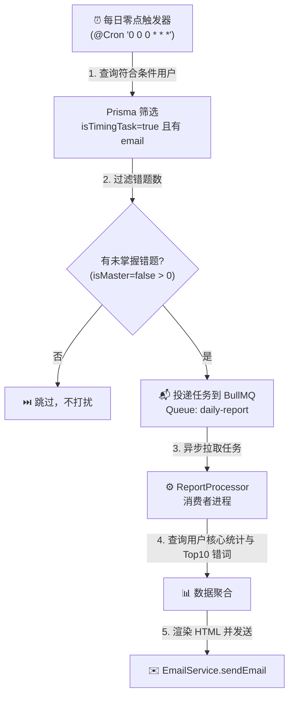

# 每日零点异步错词日报发送系统设计文档

**日期：** 2026-06-29  
**主题：** 每日零点异步错词日报发送 (Async Daily Mistake Report)  
**状态：** 已批准 (Approved)

---

## 1. 概述与业务目标

为了帮助英语学习者养成良好的每日复习习惯，巩固薄弱词汇，系统将上线**每日零点异步错词日报**功能。
系统将在每天夜晚零点自动筛选出开启了每日打卡提醒且当前有待攻克错题的用户，通过邮件把核心错题复习清单推送给用户，让用户利用碎片时间复习，并引导用户回归平台进行闯关消杀。

---

## 2. 系统架构与数据流

系统采用 **`@nestjs/schedule` 定时器 + `BullMQ` 消息队列 + `EmailService` 邮件发送** 的异步削峰解耦架构。

### 2.1 架构设计图

### 2.2 核心模块职责
- **`ReportScheduler` (调度器)**：
  - 注册 `@Cron('0 0 0 * * *')` 零点定时任务。
  - 从数据库读取符合条件的用户列表：`isTimingTask === true` 且 `email` 不为空。
  - 对满足筛选条件的每个用户，统计其当前未掌握错题数，若大于 0，则向 `daily-report` 消息队列投递发信任务。
- **`ReportProcessor` (队列消费者)**：
  - 监听 `daily-report` 队列。
  - 异步消费任务，进行数据聚合与 HTML 邮件渲染。
  - 调用基础模块的 `EmailService.sendEmail` 完成实际发信。

---

## 3. 数据组装与 HTML 邮件模板

### 3.1 数据组装 (`Data Aggregation`)
对于队列中传来的每个 `userId`，消费者将同步查询：
1. **统计面板数据**：
   - 当前待攻克错题总数 (`isMaster: false`)
   - 累计已斩杀掌握总数 (`isMaster: true`)
2. **重点复习清单 (`Top 10` 错词)**：
   - 取出最近出错/更新的 10 个错词 (`orderBy: { updatedAt: 'desc' }, take: 10, include: { word: true }`)。

### 3.2 HTML 邮件视觉设计 (`Email Template`)
采用内联 CSS 设计，确保适配各大主流客户端（QQ邮箱、网易邮箱、Gmail）：
- **深蓝渐变标头**：《📚 每日英语错词攻克日报》
- **双栏数据面板**：清晰标注待攻克数与累计掌握数。
- **复习单词表格**：包含英文单词、音标、释义翻译三列布局。
- **底部导流文案**：引导用户登录平台【专属错题本】进行特训清零。

---

## 4. 容灾、重试与接口设计

### 4.1 容灾与重试策略
- **队列自动指数退避重试**：
  投递任务时配置参数：`attempts: 3`, `backoff: { type: 'exponential', delay: 5000 }`。网络抖动或发送异常时，5s、10s、20s 后自动重试。
- **内存优化**：任务完成后配置 `removeOnComplete: true` 及时清理 Redis 缓存。

### 4.2 开发调试与测试接口
为了避免等待零点，开放测试接口供开发与验证：
- **测试触发 API**：`POST /api/v1/learn/report/test-trigger`（受 `AuthGuard` 守卫，取当前登录用户的 ID 立即触发一次组装与发信）。

---

## 5. 验收标准
1. 定时触发器能准确识别符合条件的用户，不漏发、错发。
2. 消费者能顺利拉取并渲染 HTML 邮件，邮件样式在收件箱中清晰美观。
3. 模拟网络异常时，BullMQ 能够触发重试机制。
4. 后端 `nest build` 零编译错误。
