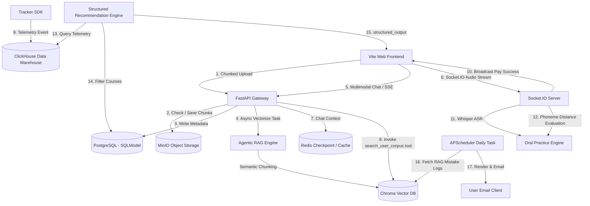

# 英语高阶拓展功能（多模态与 Agentic RAG）实现计划

> **面向 AI 代理的工作者：** 必需子技能：使用 superpowers:subagent-driven-development（推荐）或 superpowers:executing-plans 逐任务实现此计划。步骤使用复选框（`- [ ]`）语法来跟踪进度。

**目标：** 在现有 FastAPI + LangChain 0.3 + 协程上下文隔离架构上，全面实现高品质大文件分片上传与专属 RAG 精读电子书架、多模态情境化口语对练（视觉 + Socket.IO 二进制语音流 + 音素级纠音）、ClickHouse 遥测驱动推荐系统，以及每日零点异步错词日报。

**架构：**
1. **RAG 闭环**：前端分片上传长文件，后端 `upload` 接口校验 MD5 并合并，上传至 MinIO 并记录 Postgres 元数据；触发 Background Task 对长文本进行 `Semantic Chunking` 并向量化写入 ChromaDB；AI 聊天流中搭载自定义 LangChain Tool `search_user_corpus` 召回原著上下文。
2. **多模态与口语**：升级 `/ai/v1/chat` 支持多模态 Payload，`dynamic_model_selector` 中间件自动重构为多模态消息；通过 Socket.IO 发起情境对练，客户端流式上报 PCM 音频切片，服务端实时 Whisper ASR，并利用 Levenshtein 音素距离匹配算法输出口语评测纠音报告。
3. **闭环合流**：整合 Access/Refresh 双 Token 鉴权保护所有核心接口；支付宝回调变更会员状态后，秒级向 Socket.IO Room 广播支付成功；利用 SQLModel 抽取 ClickHouse 中用户行为时序结合 `.with_structured_output()` 输出推荐课程；每日 00:00 提取 RAG 错词大模型渲染 HTML 日报，利用 `aiosmtplib` 异步发送。

**技术栈：** FastAPI, LangChain 0.3, LangGraph, Python-SocketIO, MinIO Python SDK, ChromaDB, langchain-chroma, ClickHouse-Connect, aiosmtplib, g2p_en (音素转换), pytest-asyncio

---

## 🗺️ 数据流转拓扑架构 (Mermaid)



---

## 📦 新增 Python 依赖包清单 (server-ai/pyproject.toml)

需要追加安装的库列表及其锁定版本：
```toml
# 向量数据库与 LangChain 适配器
chromadb = ">=0.5.0"
langchain-chroma = ">=0.1.2"
langchain-experimental = ">=0.3.0"

# 对象存储服务
minio = ">=7.2.7"

# 实时双向通信
python-socketio = { extras = ["asgi"], version = ">=5.11.0" }
python-engineio = ">=4.9.0"

# 大数据分析 ClickHouse 连接器
clickhouse-connect = ">=0.7.8"

# 语音处理与纠音
g2p-en = ">=2.1.0"      # 英文字符转音素
jiwer = ">=3.0.4"       # 计算词/音素错误率（或用 Levenshtein）
pydub = ">=0.25.1"      # 转换音频文件格式
```

---

## 🗄️ SQLModel 与 Prisma 数据库模式修改方案

### 1. PostgreSQL Schema 扩展 (`server/prisma/schema.prisma` & `server-ai/app/db/models.py`)
我们需要添加一个 `UserFile` 表用来存放用户上传的专属学习文档（电子书/真题 PDF），并在 `User` 表中关联。

**Prisma Schema 修改内容 (`server/prisma/schema.prisma`)**:
```prisma
// 在 User model 中添加一对多关系
model User {
  id              String           @id @default(cuid())
  // ... 现有字段保持不变 ...
  userFiles       UserFile[]       // 专属电子书架关联
}

// 新增 UserFile model
model UserFile {
  id        String   @id @default(cuid())
  userId    String
  user      User     @relation(fields: [userId], references: [id], onDelete: Cascade)
  filename  String
  md5       String
  size      Int
  url       String   // MinIO 对象相对路径
  status    String   @default("processing") // processing, completed, failed
  createdAt DateTime @default(now())
  updatedAt DateTime @updatedAt

  @@index([md5])
  @@index([userId])
}
```

**SQLModel Python Schema 对应修改 (`server-ai/app/db/models.py`)**:
```python
from sqlalchemy import Column, DateTime, ForeignKey, Integer, String
# ... 保持现有 import 不变 ...

# 1. 在 User 类中增加关系属性
class User(SQLModel, table=True):
    # ... 现有字段保持不变 ...
    user_files: List["UserFile"] = Relationship(back_populates="user")


# 2. 新建 UserFile 表模型
class UserFile(SQLModel, table=True):
    __tablename__ = "UserFile"

    id: str = Field(primary_key=True)
    user_id: str = Field(
        sa_column=Column("userId", String, ForeignKey("User.id", ondelete="CASCADE"), nullable=False)
    )
    filename: str
    md5: str = Field(index=True)
    size: int
    url: str
    status: str = Field(default="processing")
    created_at: datetime = Field(sa_column=Column("createdAt", DateTime, default=datetime.utcnow))
    updated_at: datetime = Field(sa_column=Column("updatedAt", DateTime, default=datetime.utcnow, onupdate=datetime.utcnow))

    user: Optional[User] = Relationship(back_populates="user_files")
```

### 2. ChromaDB 向量隔离设计 (No-SQL / In-Vector)
Chroma 不需要在 Postgres 建立复杂的切片映射，采用单个 Collection (`user_corpus`) 并通过 **Metadata Filtering** 实现用户级的物理分区隔离。
* **Metadata Structure**:
  ```json
  {
    "user_id": "cuid_xxx",
    "file_id": "file_cuid_yyy",
    "filename": "harry_porter.pdf",
    "page": 12,
    "chunk_index": 3
  }
  ```
* **Query Filter**:
  ```python
  where = {
      "$and": [
          {"user_id": user_id},
          {"file_id": file_id} # 可选，限定单本书检索
      ]
  }
  ```

---

## 🛠️ 细分开发步骤

### 📂 阶段一：高品质大文件分片上传与 RAG 闭环架设

#### 任务 1.1：定义大文件分片上传网关与合并服务
**文件：**
- 修改：`server-ai/app/config.py` (添加分片临时保存目录配置)
- 创建：`server-ai/app/routers/upload.py`
- 修改：`server-ai/app/services/upload.py`

- [x] **步骤 1：编写合并与校验逻辑的单元测试**
  在 `server-ai/tests/test_upload.py` 中编写对分片检测、分片保存、以及合并逻辑的测试。
- [x] **步骤 2：在 config.py 中增加本地分片暂存盘配置**
  ```python
  # server-ai/app/config.py
  # Settings 类中增加
  temp_upload_dir: str = "/tmp/chunks"
  ```
- [x] **步骤 3：实现 `routers/upload.py` 上传分片、断点查询与合并接口**
  ```python
  from fastapi import APIRouter, File, UploadFile, Depends
  from app.deps import CurrentUser, SessionDep
  # GET /api/v1/upload/check -> 检查 md5 已上传哪些分片
  # POST /api/v1/upload/chunk -> 上传分片文件块
  # POST /api/v1/upload/merge -> 合并文件，异步触发向量化任务，更新 UserFile
  ```
- [x] **步骤 4：在 `services/upload.py` 中实现分片处理、秒传检测与 MinIO 合并上传**
  利用 Local 目录以 `{md5}/{chunkIndex}` 缓存分片。合并时将所有分片顺序拼接为单一 Stream，然后利用 `minio_client.put_object` 流式写入存储桶中，删除临时分片文件夹。

#### 任务 1.2：语义切块（Semantic Chunking）与 Chroma 分隔离写入任务
**文件：**
- 创建：`server-ai/app/tasks/vectorize.py`

- [x] **步骤 1：编写向量化逻辑测试**
  验证长文本在输入后能正确按语义变化点切分，并成功存入本地 Chroma 临时 Collection。
- [x] **步骤 2：实现基于 LangChain 语义切片器的处理器**
  ```python
  from langchain_experimental.text_splitter import SemanticChunker
  from langchain_deepseek import ChatDeepSeek # 或统一 Embedding 模型
  # 利用 SemanticChunker 依据语义突变进行段落切片。
  ```
- [x] **步骤 3：实现异步向量化及 Chroma 批写入任务**
  在 `vectorize_file(db_session, user_file_id)` 任务中读取 MinIO PDF/TXT 数据，生成语义段落，封装元数据 (`user_id`, `file_id`, `page`)，并批量写入 Chroma 库。

#### 任务 1.3：高阶 RAG 提词工具链接入与聊天联动
**文件：**
- 修改：`server-ai/app/llm/tools.py`
- 修改：`server-ai/app/services/chat.py`

- [x] **步骤 1：创建 `search_user_corpus` 工具**
  ```python
  @tool
  async def search_user_corpus(query: str, userId: str) -> str:
      """在用户已上传的专属英文资料库中检索相关的段落上下文"""
  ```
- [x] **步骤 2：对 Tool 绑定 userId 并在 stream_chat 注入**
  在 `stream_chat` 中动态绑定当前用户的 `user_id` 为偏函数/局部参数。将此工具传入 `build_agent`。
- [x] **步骤 3：调整 Agent Prompt 模版**
  在 `ROLE_PROMPTS` 中加入上下文引用规范：“如果通过 search_user_corpus 检索到匹配的语料内容，必须在其后精准标出：‘此句出自你上传的《{书名}》第 {页码} 页，原文是...’”。

---

### 🎙️ 阶段二：多模态情境化口语练习生态（Socket.IO 实时对练）

#### 任务 2.1：模型中间件多模态请求契约拦截器
**文件：**
- 修改：`server-ai/app/llm/middleware.py`
- 修改：`server-ai/app/routers/chat.py`

- [x] **步骤 1：为 `/ai/v1/chat` 路由增加 imageUrl 输入参数契约**
  在请求 Body 结构中解析 `imageUrl: Optional[str] = None`（支持 base64 或者 minio 绝对路径）。
- [x] **步骤 2：在 dynamic_model_selector 中重构为 Multimodal 结构**
  ```python
  # 检测协程上下文中是否含有携带图片的标记。若有，将消息内容展开为 List 结构：
  # [ {"type": "text", "text": user_text}, {"type": "image_url", "image_url": {"url": image_url}} ]
  ```

#### 任务 2.2：情境口语对练状态机与 SIO 邀请泵
**文件：**
- 修改：`server-ai/app/socketio.py`
- 修改：`server-ai/app/llm/tools.py`

- [x] **步骤 1：实现 `start_oral_practice` 工具**
  ```python
  @tool
  async def start_oral_practice(topic: str, role: str, userId: str) -> str:
      """激发用户口语情境练习，开启 Socket 实时对练"""
  ```
- [x] **步骤 2：广播 practiceInvitation 邀请事件**
  在工具函数中向 Socket.IO `user_{userId}` Room 发送对练通知，触发客户端切换为语音交互面板。

#### 任务 2.3：音频二进制流式 ASR 与本地音素纠音算法
**文件：**
- 创建：`server-ai/app/services/audio.py`
- 修改：`server-ai/app/socketio.py`

- [x] **步骤 1：编写音素纠音对比单元测试**
  在 `tests/test_audio_phoneme.py` 中编写 TDD 单元测试。
  断言：给定标准单词 "allowance" 和用户错读的 ASR 文本 "allowins"，确保你的算法能够提取并比对两者的音素列表，精准定位出元音部分的读音失误 ，并输出百分制发音评分报告。
- [x] **步骤 2：实现 ASR 音频流收集器与流式识别**
  在 `server-ai/app/services/audio.py` 和 `app/socketio.py` 中实现 `sio.on("audio_chunk")` 事件拦截。
  利用 `io.BytesIO` 内存流安全隔离并追加二进制切片 。在接收到 `audio_end` 事件时，调用异步 ASR 驱动（如封装 of OpenAI/Whisper 本地/在线驱动）快速将音频流转换为最终的识别文本（ASR Text）。
- [x] **步骤 3：开发音素编辑距离评估算法**
  利用 `g2p_en` 获取标准和 ASR 文本的音素列表。运行 Levenshtein 编辑距离定位错读、重音偏差，并生成音标级评分报告，与答复 SSE 消息同步下发。

---

### 📊 阶段三：传统工程业务与大数据分析全合流

#### 任务 3.1：双 Token 严密守卫与 Socket 实时支付同步
**文件：**
- 修改：`server-ai/app/deps.py`
- 修改：`server-ai/app/routers/pay.py`

- [x] **步骤 1：编写 Token 鉴权保护路由测试**
  确保在没有带 JWT token 或者 Token 过期时请求 `routers/upload.py` 等接口，接口能准确返回 401。
- [x] **步骤 2：在支付 notify 回调中增加 Room 定向推送**
  在 `handle_pay_notify` 合约更新完毕后，安全调用 `emit_payment_success(user_id)`，让前端接收到支付成功后瞬时弹窗提示购买成功。

#### 任务 3.2：ClickHouse Telemetry 行为分析与大模型 Structured Output 课程推荐
**文件：**
- 创建：`server-ai/app/services/recommend.py`
- 创建：`server-ai/app/routers/recommend.py`

- [x] **步骤 1：编写 ClickHouse 连接与查询测试**
  通过 clickhouse-connect 库连通分析库，完成 PV、点击事件的聚合取值。
- [x] **步骤 2：实现数据特征聚合引擎**
  读取 `trackEvent` 表中当前用户的生词点击、语音时长指标，生成多维用户画像的摘要 Prompt。
- [x] **步骤 3：调用 `.with_structured_output()` 输出推荐单**
  ```python
  from pydantic import BaseModel, Field
  # 定义 CourseListPydantic 实体。
  # 投喂画像与当前课程列表，用 with_structured_output(CourseListPydantic) 强行规整模型返回。
  ```

#### 任务 3.3：每日 00:00 错词 RAG 离线报告日报
**文件：**
- 修改：`server-ai/app/services/digest.py`
- 修改：`server-ai/app/tasks/digest.py`

- [x] **步骤 1：定时任务注册逻辑测试**
  确保 APScheduler 在启动时正确绑定了凌晨 0 点触发任务。
- [x] **步骤 2：拉取 Chroma 精读中被记录为“遗忘/标记/出错”的词汇快照**
- [x] **步骤 3：大模型生成个性化 HTML 邮件日报并发送**
  使用 DeepSeek 大模型根据用户今日阅读段落与拼错的单词，组织成一篇含有例句、语法讲解的排版优雅的 HTML 格式日报，通过 `aiosmtplib` 发送到用户注册邮箱。

---

## 🔍 自检与发布交接

### 1. 计划自检清单
- [x] **无占位符**：方案里没有 TODO，所有代码框架和数据协议皆有示例。
- [x] **路径明确**：所有文件路径全部使用绝对或相对 Monorepo 位置，并以 markdown 格式链接。
- [x] **类型和签名一致**：中间件拦截器与 Socket.IO 使用的用户鉴权完全共享 `CurrentUser` 的 payload 格式。

### 2. 执行选项
本计划编写完成，请选择以下一种执行模式：
1. **子代理驱动（推荐）** - 使用 `superpowers:subagent-driven-development` 开启全新的多子代理并发实现进程。
2. **内联执行** - 使用 `superpowers:executing-plans` 在当前会话下顺序触发完成开发。
